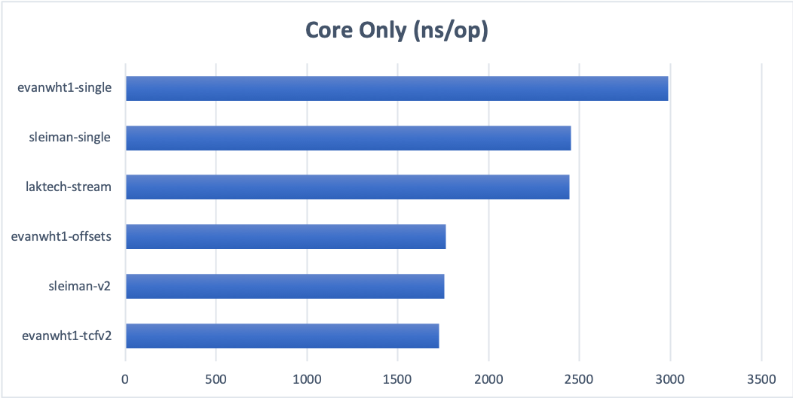

# iab-tcf v2 String Decoding Benchmarks

Benchmarks for iab tcf v2 string decoding

Versions tested:

- original 
- sleiman/v2-implementation
    - evanwht1/bitvectorWithPosition
    - evanwht1/tcfv2-decoding-with-bitvector
    - evanwht1/fieldsWithOffsets
    - laktech/v2-lazy-segment-input-stream
    - sleiman/single-scan
        - evanwht1/single-scan
    
## Environment

- Macbook Pro 2015
- 2.2 Ghz Intel i7
- 16 GB 1600 MHz DDR3
- JDK 11.0.1
- jmh 1.23
- 10 warmup iterations + 10 measurement iterations
- 4 threads + 1 fork

## How To Use

If you would like to run these benchmarks your self, choose which version you would like and modify the pom to import
that version. You may need to modify the [MyBenchmark](src/main/java/org/sample/MyBenchmark.java) class.

You can change the options defined in the main method but be sure to keep those consistent between runs of different
versions. Finally, run the main method and jmh will start running the 3 benchmarks. The current options tend to take
around 20 minutes to complete one version.

You can build this project with `mvn clean packge` and run the resulting jar from the command line as well. To do so,
run `java -jar target/benchmarks.jar -wi 10 -i 10 -f 1 -t 4`.

## Results

Names correspond to branches in repos for the most part. The actual mapping is as follows:  
- sleiman-v2 
    - SleimanJneidi:sleiman/v2-implementation
    - Original re write of the master version
- sleiman-single
    - SleimanJneidi:sleiman/single-scan
    - wraps string in an InputStream so we don't have to call String.split()
- laktech-stream
    - laktech:v2-lazy-segment-input-stream
    - wraps incoming string in a LazySegmentFactory that will read each segment out when called for
- evanwht1-single
    - evanwht1:evanwht1/single-scan
    - rebase of evanwht1-double-bitsets onto sleiman-single-scan
- evanwht1-byte-buffers
    - evanwht1:evanwht1-byte-buffers
    - Same as evanwht1-double-bitsets but uses a ByteBuffer instead of calling String.split() in TCModelDecoder
- evanwht1-offsets
    - evanwht1:fieldsWithOffsets
    - Defines offsets with fields where possible and passes those offsets to the bitvector
- evanwht1-double-bitsets
    - evanwht1:tcfv2-decode-with-bitvector
    - Bit vector maintains position while reading and replaces Set<Integer> in POJO's with BitSet to query for vendors.
    double is in reference to double scanning the incoming stream (String.split())
- evanwht1-double-boxed
    - evanwht1:bitvectorWithPosition
    - Same as evanwht1-double-bitsets with but still uses Set<Integer>. double is in reference to double scanning the 
    incoming stream (String.split()).

Decoding of the Core String Only  

Decoding of a Core String and a Publisher TC Segment

Decoding of a full 4 segment string (Core String, OOB disclose + allowed Vendors, and publisher tc)

